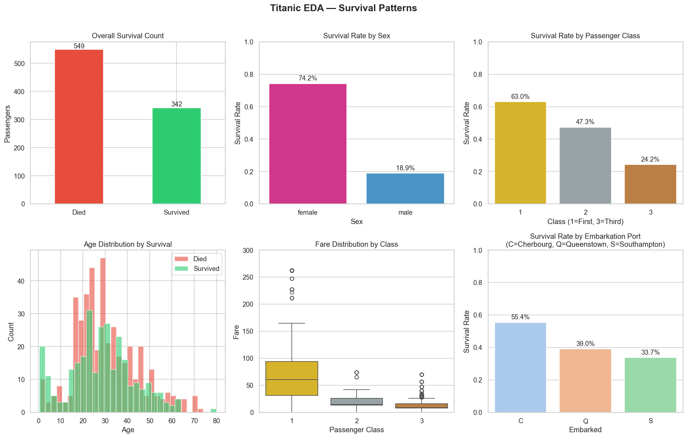
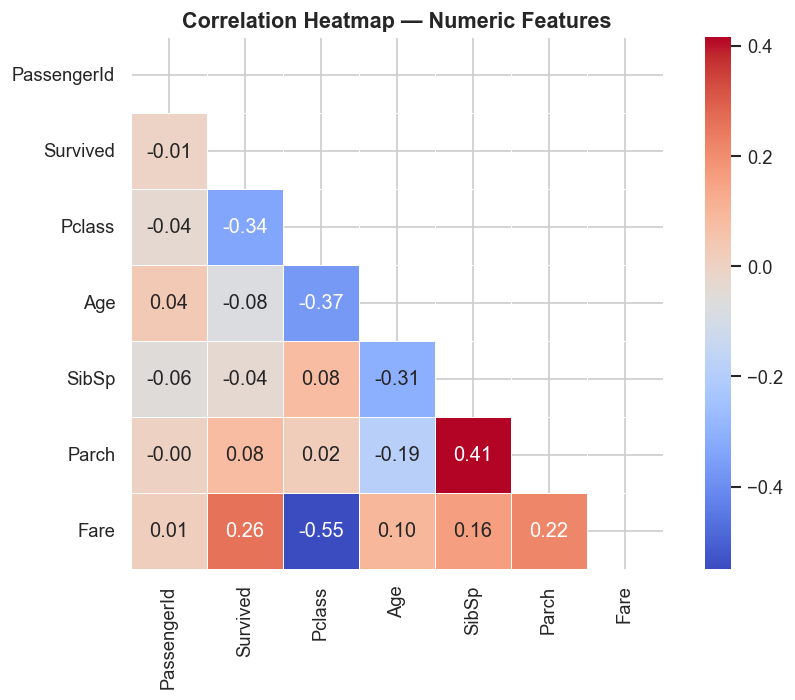
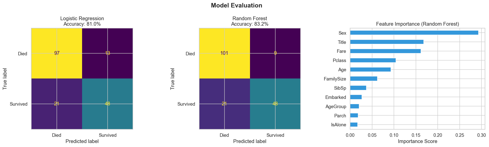

# Titanic Survival Prediction

A complete machine learning project that predicts passenger survival on the RMS Titanic using Logistic Regression and Random Forest classifiers.

**Course:** AI5120 | **Student:** Tianyi Shi

---

## Overview

This project walks through the full data science pipeline on the [Kaggle Titanic dataset](https://www.kaggle.com/c/titanic/data):

1. Data loading & exploration
2. Exploratory Data Analysis (EDA) with visualizations
3. Data cleaning & preprocessing
4. Feature engineering
5. Model training & evaluation

---

## Results

| Model | Accuracy |
|---|---|
| Logistic Regression | 81.0% |
| Random Forest | **83.2%** |

**Top 3 most important features (Random Forest):** Sex, Title, Fare

---

## Project Structure

```
├── Titanic - Machine Learning.py   # Main script
├── train.csv                       # Training data (891 passengers)
├── test.csv                        # Test data
├── gender_submission.csv           # Sample submission file
├── eda_survival_patterns.png       # EDA visualization (6 charts)
├── eda_correlation_heatmap.png     # Correlation heatmap
├── model_evaluation.png            # Confusion matrices + feature importance
├── Project_Documentation.docx     # Full project documentation
└── README.md
```

---

## Setup

**1. Clone the repository**
```bash
git clone https://github.com/YOUR_USERNAME/titanic-survival-prediction.git
cd titanic-survival-prediction
```

**2. Install dependencies**
```bash
pip install pandas numpy matplotlib seaborn scikit-learn
```

**3. Run the project**
```bash
python "Titanic - Machine Learning.py"
```

---

## Workflow

### Data Exploration
- 891 passengers, 12 columns
- Key missing values: Age (19.9%), Cabin (77.1%), Embarked (0.2%)
- Overall survival rate: 38.4%

### EDA Findings
- **Sex:** Females survived at 74.2% vs. 18.9% for males
- **Class:** 1st class (63.0%) vs. 2nd (47.3%) vs. 3rd (24.2%)
- **Embarkation:** Cherbourg (55.4%) > Queenstown (39.0%) > Southampton (33.7%)
- **Age:** Children (0–10) had notably higher survival rates

### Data Cleaning
| Step | Action |
|---|---|
| Missing Age | Filled with median grouped by Sex + Pclass |
| Missing Embarked | Filled with mode (Southampton) |
| Cabin | Dropped (77% missing) |
| Ticket | Dropped (no predictive signal) |

### Feature Engineering
| Feature | Description |
|---|---|
| `Title` | Extracted from Name (Mr, Mrs, Miss, Master, Rare) |
| `FamilySize` | SibSp + Parch + 1 |
| `IsAlone` | 1 if travelling solo, else 0 |
| `AgeGroup` | Age binned into Child / Teen / Adult / Middle-aged / Senior |

### Models
- **Logistic Regression** — interpretable baseline (`max_iter=500`)
- **Random Forest** — ensemble of 200 trees (`max_depth=6`, `n_jobs=-1`)
- Train/test split: 80/20, stratified by survival label

---

## Visualizations

**EDA — Survival Patterns**



**Correlation Heatmap**



**Model Evaluation**



---

## Dependencies

- Python 3.x
- pandas
- numpy
- matplotlib
- seaborn
- scikit-learn